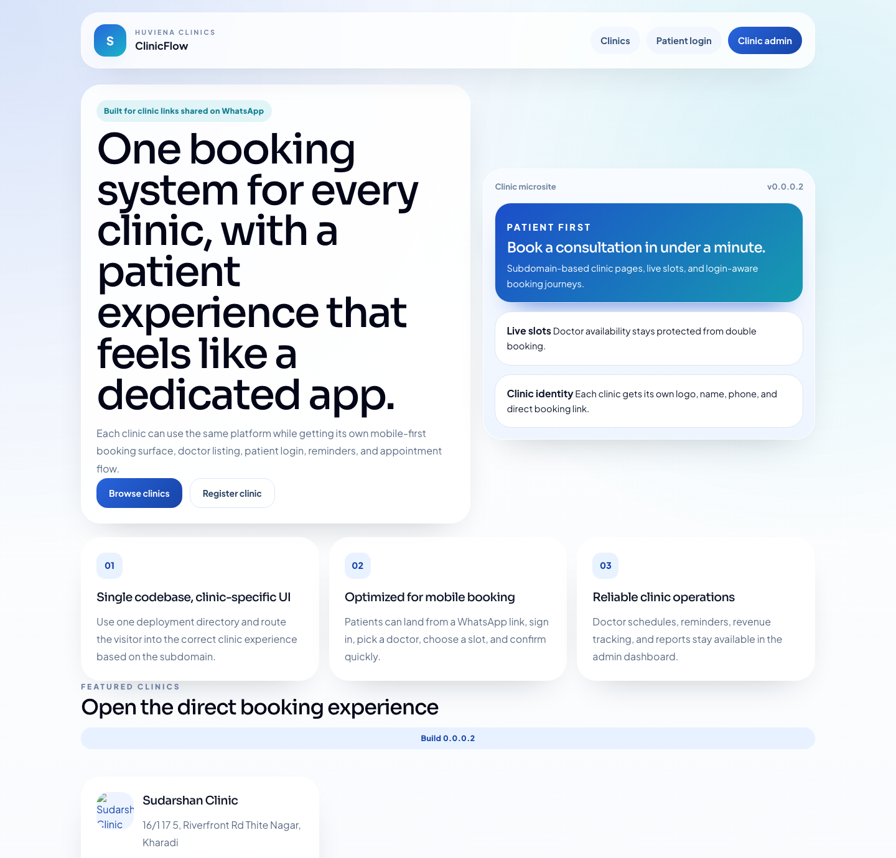
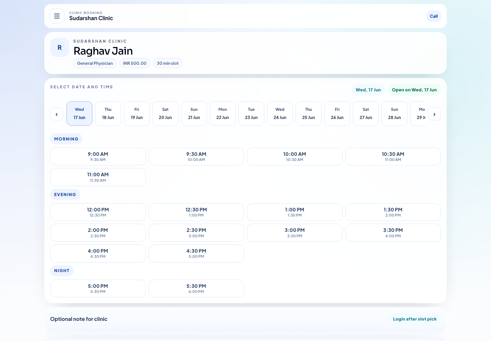
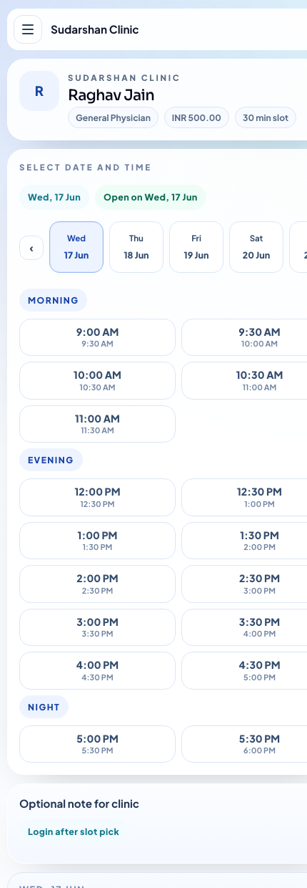
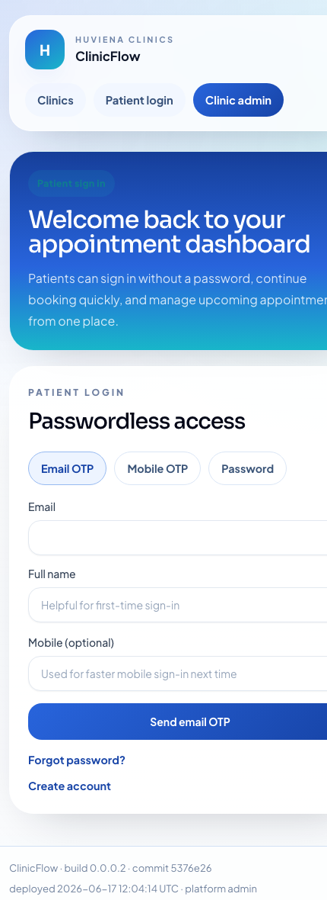
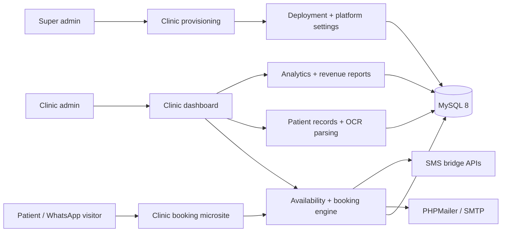

# ClinicFlow

<div align="center">
  <p>
    <strong>Mobile-first appointment booking system for small clinics</strong><br />
    Built for real patient traffic, clinic subdomains, and standard Linux shared hosting.
  </p>

  <p>
    <a href="https://appointment.huviena.com"><strong>Live Demo</strong></a>
    ·
    <a href="INSTALL.md"><strong>Shared Hosting Install</strong></a>
    ·
    <a href="AUTO_DEPLOY.md"><strong>Git Auto Deploy</strong></a>
  </p>

  <p>
    
    
    
    
    
    
  </p>
</div>

<p align="center">
  
</p>

## Overview

ClinicFlow is a production-oriented booking platform designed for clinics that want a polished patient experience without relying on Docker, Redis, Kubernetes, WordPress, or VPS-only tooling.

One deployment can power multiple clinic microsites. Each clinic can have its own branded booking link or subdomain, while the same codebase handles:

- patient booking with live slot availability
- clinic admin operations and doctor schedules
- revenue and appointment analytics
- passwordless login with OTP and Google sign-in
- email notifications and reminder workflows
- patient records with prescription OCR support

This repository is especially strong as a showcase project because it combines product thinking, UX, backend workflow design, deployment ergonomics, and real operational features in one app.

## Why This Project Stands Out

- **Single deployment, many clinic experiences**: clinic identity can change automatically by host or subdomain.
- **Booking-first UX**: optimized for patients arriving from WhatsApp or direct booking links on mobile.
- **Shared-hosting friendly**: ZIP upload + browser installer works even when terminal access is unavailable.
- **Real scheduling logic**: weekly availability, date overrides, blocked slots, holidays, and double-booking protection.
- **Operational depth**: analytics, revenue reporting, reminders, exports, patient records, and OCR parsing.
- **Git-friendly deployment story**: external env file support and Hostinger Git deployment flow are built in.

## Product Screenshots

> Screens below were captured from the live deployment at [appointment.huviena.com](https://appointment.huviena.com).

<p align="center">
  
</p>

<table>
  <tr>
    <td width="50%" valign="top">
      
      <p><strong>Mobile booking experience</strong><br />Date-first, slot-first flow built for quick appointment confirmation.</p>
    </td>
    <td width="50%" valign="top">
      
      <p><strong>Passwordless patient access</strong><br />Email OTP, mobile OTP bridge, password fallback, and Google sign-in.</p>
    </td>
  </tr>
</table>

## Feature Breakdown

<details open>
  <summary><strong>Patient Experience</strong></summary>

  - Clinic-specific booking page with clinic branding and direct doctor selection
  - Live date and time slot discovery
  - Email OTP login
  - Mobile OTP login with bridge endpoints for Android-based SMS sending
  - Google sign-in
  - Appointment booking, rescheduling, cancellation, and dashboard history
  - Email confirmation and reminder support

</details>

<details>
  <summary><strong>Clinic Admin Experience</strong></summary>

  - Clinic profile management with logo, phone, address, and email
  - Doctor CRUD with specialization, fee, slot duration, and profile photo
  - Clinic timings and doctor-specific availability rules
  - Upcoming, today, completed, cancelled, and rescheduled appointment management
  - Analytics dashboard for booking volume, new patients, and utilization
  - Revenue dashboard and exportable reports
  - Patient visit records, prescription uploads, and OCR-assisted medication parsing

</details>

<details>
  <summary><strong>Platform / Super Admin Controls</strong></summary>

  - Fixed super admin access for platform-level operations
  - Create, activate, deactivate, and delete clinics
  - Manage deploy token / deployment settings
  - Configure optional hosted OCR settings for prescription parsing
  - Publish SMS bridge endpoints for external mobile sender apps

</details>

## Security And Reliability

- Password hashing for stored credentials
- CSRF protection on form submissions
- Escaped output in views to reduce XSS risk
- PDO-based database access with prepared statements
- Role-based access for patient, clinic admin, and super admin surfaces
- Double-booking prevention using availability filtering plus booking guard logic
- Appointment status logs, analytics events, email logs, and soft deletes

## Architecture



## Tech Stack

| Layer | Technology |
| --- | --- |
| Backend | PHP 8.3+ |
| Database | MySQL 8+ |
| UI | Tailwind CSS + custom experience layer |
| Frontend behavior | Vanilla JavaScript |
| Calendar | FullCalendar |
| Email | PHPMailer with SMTP |
| Architecture | Lightweight MVC + service layer |
| Reporting | CSV, Excel-compatible XLS, PDF |
| Hosting target | Standard Linux shared hosting |

## REST API Snapshot

### Public APIs

- `GET /api/v1/clinics`
- `GET /api/v1/clinics/{slug}/doctors`
- `GET /api/v1/doctors/{id}`
- `GET /api/v1/doctors/{id}/slots?date=YYYY-MM-DD`

### Authenticated / workflow APIs

- `POST /api/v1/appointments`
- `POST /api/v1/appointments/{id}/cancel`
- `GET /api/pending-sms?token=...`
- `POST /api/sms-status`

The SMS bridge endpoints are designed for a companion Android app that polls pending OTP messages and reports delivery status back to ClinicFlow.

## Setup

<details open>
  <summary><strong>Local Development Setup</strong></summary>

1. Clone the repository.
2. Copy the env template.
3. Create a MySQL database.
4. Update your database, app URL, SMTP, and auth settings.
5. Run migrations.

```bash
git clone https://github.com/lokeshdeshmukh/clinic.git
cd clinicflow
cp .env.example .env
php scripts/migrate.php
```

Useful notes:

- `public/assets/css/app.css` is already built and committed.
- If you edit frontend styles, rebuild assets with:

```bash
npm install
npm run build:css
```

- Serve the app through your preferred PHP web stack and route requests through `public/index.php` or the included root/public rewrite setup.

</details>

<details>
  <summary><strong>Shared Hosting Setup (No Terminal)</strong></summary>

This project is intentionally designed to work when you only have a hosting file manager.

1. Create a subdomain.
2. Upload the project ZIP into that subdomain folder.
3. Extract the files.
4. Visit `/install/`.
5. Complete the browser installer with DB and SMTP settings.

```text
https://your-subdomain.com/install/
```

The installer will:

- create the env file
- run migrations and seeds
- create the install lock
- prepare uploads and logs directories

See [INSTALL.md](INSTALL.md) for the full walkthrough.

</details>

<details>
  <summary><strong>Git-Based Updates On Shared Hosting</strong></summary>

ClinicFlow supports a Git-first deployment flow for hosts like Hostinger.

- Keep secrets outside the deployed repo using `.clinicflow.env`
- Connect the repository in your hosting panel
- Deploy the `main` branch
- Let the app auto-detect the external env file on future updates

See [AUTO_DEPLOY.md](AUTO_DEPLOY.md) for the full workflow.

</details>

<details>
  <summary><strong>Scheduled Reminder Job</strong></summary>

To send appointment reminders, run the bundled reminder script hourly:

```text
/usr/bin/php /home/USERNAME/path-to-app/scripts/send_reminders.php
```

</details>

## Current Product Direction

ClinicFlow is especially optimized for a **1-to-1 clinic booking model**:

- a new clinic can get its own subdomain
- that subdomain opens the clinic-specific booking experience directly
- patients see the clinic name first, available doctors next, and live slots immediately
- the same backend still supports multiple clinics from one deployment

This makes the platform practical both as a SaaS-style multi-tenant system and as a clinic-branded microsite product.

## Repository Structure

```text
app/
  Controllers/     HTTP controllers
  Core/            framework-like plumbing (router, request, response, auth, env)
  Models/          database models
  Services/        business workflows
  ThirdParty/      bundled PHPMailer
bootstrap/         app bootstrap
config/            app, database, and service configuration
database/
  migrations/      SQL migrations
  seeds/           seed SQL
public/
  assets/          built CSS and JS
  uploads/         public uploads
  install/         browser installer
resources/views/   PHP view templates
routes/            web and API routes
scripts/           migration + reminder scripts
storage/           logs, cache, uploads, version metadata
```

## Why This Reads Well On GitHub

This repository demonstrates more than CRUD:

- product UX for a real appointment journey
- full-stack PHP application design without a heavy framework
- subdomain-aware multi-clinic routing
- deployment thinking for non-technical hosting environments
- admin operations, analytics, revenue tracking, and patient records
- API design for companion services like SMS bridge delivery

If you want a project that shows both **engineering depth** and **business usefulness**, this one does that well.

## Documentation

- [INSTALL.md](INSTALL.md) - full installation guide
- [AUTO_DEPLOY.md](AUTO_DEPLOY.md) - Git deployment workflow for shared hosting
